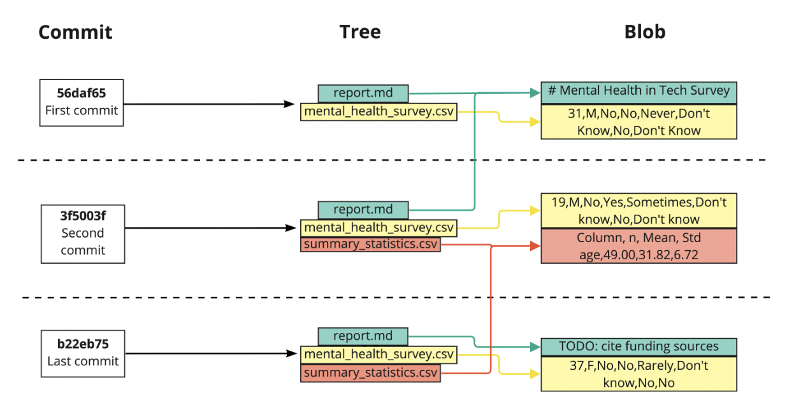

# 02 - Making changes

## The commit structure

Git commits have **three** parts:

1. **Commit** contains the metadata such as *author*, *commit message*, and *time of the commit*. Each commit is identified by *hash*.

2. **Tree** tracks the names and locations in the repo when that commit happened.

3. **Blob**, for each file listed in the tree, is short for *binary large object*. It may contain data of any kind. It contains compressed snapshot of a file's contents when the commit happened.

### Visualizing the commit structure



### View commit information by `git log`

We can view commit information using:

```shell
git log
```

This will display all commits maded to the repo in chronological order, starting with the oldest.

It will show the commit hash, author, date, and commit message.

If the output does not fit in the terminal windows:

- `spacebar` to show more recent commits.
- `q` to quit the log and return to the terminal.

### Git hash

- It is a 40-character string of numbers and letters.
- Git produces it using a pseudo-random number generator called a hash function.
- Hashes allow *data sharing* between repos.
  - If two files are the same, then their hashes are the same.
- Git only needs to compare hashes to tell what information needs to be saved in which location by comparing hashes rather than entire files.

### Finding a particular commit

- First, `git log` and find the first 6-8 characters of the `hash` of the commit to examine.
- Then, `git show <hash-characters>`, for example, to show its detail of that commit.

---

## Viewing changes

### The HEAD shortcut

```shell
git diff -r HEAD
```

- Compares staged files to the version in the last commit.
- Use a tilde `~` to pick a specific commit to compare versions:
  - `HEAD~1` = the second most recent commit
  - `HEAD~2` = the commit before that
- Must not use spaces begore or after the tilde `~`.

### Using HEAD with `git show`

```shell
git show HEAD~3
```

### To see what changed between two commits

```shell
git diff 35f4b4d 186398f

# or

git diff HEAD~3 HEAD~2
```

### To show line-by-line changes and associated metadata

```shell
git annotate <a-file-name>
```

This is to see who made the last change to each line of a file, and when the change took place.

---

## Undo changes before committing

### Unstaging a single file in Git

```shell
git reset HEAD <a-file-name>
```

and restage it after we edit it by:

```shell
git add <a-file-name>
```

then make a commit for that file only by:

```shell
git commit -m "<commit-log-message>"
```

### Unstaging all files

```shell
git reset HEAD
```

### Undo changes from an unstaged file back to the version in the last commit

```shell
git checkout -- <a-file-name>
```

`checkout` means switching to a different version:

- Default to the last commit

### Undo changes from all unstaged files

```shell
git checkout .
```

- `.` refers to the current directory when used in a shell command.
- This command will undo changes to all unstaged files in the current directory and sub-directories.

### Unstaging and undoing

```shell
git reset HEAD
git checkout .
```

and to stage them and save it again:

```shell
git add .
git commit -m "<commit-log-message>"
```

---

## Restoring and reverting

### Customizing the log output as a project scaled

We can restrict the number of commits displayed using `-<a-number-of-most-recent-commits-to-display>`

```shell
git log -3
```

To only look at the commit history of one file:

```shell
git log -3 report.md
```

Restrict `git log` by date:

```shell
git log --since='Month Day Year'

# For example, since 2nd April 2022
git log --since='Apr 2 2022'

# For example, between two dates
git log --since='Apr 2 2022' --until='Apr 11 2022'
```

### Restoring an old version of a file

```shell
git checkout -- <a-file-name>
```

To revert to a version from a specific commit:

```shell
git checkout <commit-hash> <a-file-name>
```

This was the second to last commit, so another approach is:

```shell
git checkout HEAD~1 <a-file-name>
```

### Restoring a repo to a previous state

```shell
git checkout <commit-hash>
```

Alternatively:

```shell
git checkout HEAD~1
```

### Cleaning a repository

To see files that are not currently being tracked:

```shell
git clean -n
```

- `-n` to list all untracked files.

Delete those files:

```shell
git clean -f
```

> NOTE: `git clean -f` cannot be undone.

---
