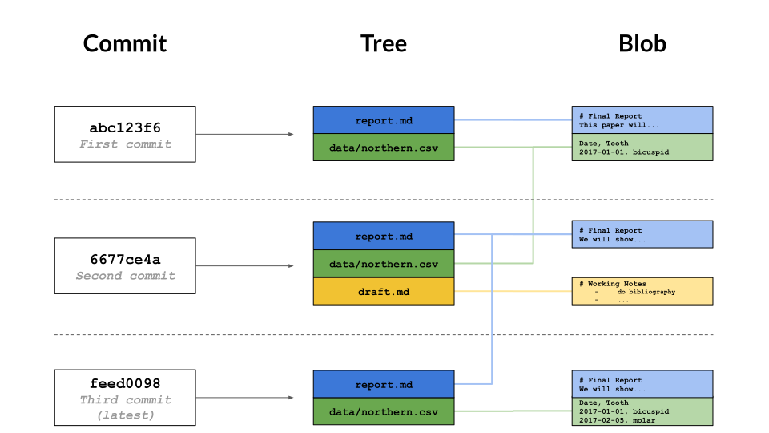

# 02 - Repositories

## How does Git store information?

Git uses a three-level structure for this.

1. A **commit** contains **metadata** such as the author, the commit message, and the time the commit happened. In the diagram below, the most recent commit is at the bottom (feed0098), underneath its parent commits.

2. Each commit also has a **tree**, which tracks **the names and locations in the repository when that commit happened**. In the oldest (top) commit, there were two files tracked by the repository.

3. For each of the files listed in the tree, there is a **blob**. This contains **a compressed snapshot of the contents of the file when the commit happened** (blob is short for binary large object, which is a SQL database term for "may contain data of any kind").



---

## What is a hash?

Every **commit** to a repository has **a unique identifier** called a **hash** (since it is generated by running the changes through a pseudo-random number generator called a hash function).

This **hash** is normally written as *a 40-character hexadecimal string* like 7c35a3ce607a14953f070f0f83b5d74c2296ef93, but most of the time, you only have to give Git the first 6 or 8 characters in order to identify the commit you mean.

**Hashes** are what enable Git to share data efficiently between repositories. *If two files are the same, their hashes are guaranteed to be the same*. Similarly, *if two commits contain the same files and have the same ancestors, their hashes will be the same as well*.

Git can therefore tell what information needs to be saved where by **comparing hashes** rather than comparing entire files.

---

## How can I view a specific commit?

By `git show` for the most recent commit and `git show <minified-hash-code>` for a specific comment.

To view the details of a specific commit, you use the command `git show` with the first few characters of the commit's hash. For example, the command `git show 0da2f7` produces this:

```text
commit 0da2f7ad11664ca9ed933c1ccd1f3cd24d481e42
Author: Rep Loop <repl@datacamp.com>
Date:   Wed Sep 5 15:39:18 2018 +0000

    Added year to report title.

diff --git a/report.txt b/report.txt
index e713b17..4c0742a 100644
--- a/report.txt
+++ b/report.txt
@@ -1,4 +1,4 @@
-# Seasonal Dental Surgeries 2017-18
+# Seasonal Dental Surgeries (2017) 2017-18

 TODO: write executive summary.
```

- The first part is the same as the log entry shown by `git log`.
- The second part shows the changes; as with `git diff`.

---

## What is Git's equivalent of a relative path?

A **hash** is like an absolute path that identifies a specific commit.

`HEAD~N`, while `N` is an integer, is like a relative path to a commit referring from the most recent commit `HEAD` by `N` commits before it.

- `HEAD~1` refers to the commit before `HEAD`
- `HEAD~2` refers to the commit before `HEAD~1` and so on.

### Example

```shell
# show the most recent commiet
git show HEAD

# show the commit made just before the most recent one
git show HEAD~1
```

---

## How can I see who changed what in a file?

By `git annotate path/to/file`.

`git log` displays the overall history of a project or file, but Git can give even more information.

The command `git annotate path/to/file` shows who made the last change to each line of a file and when.

For example, the first three lines of output from `git annotate report.txt` look something like this:

```text
04307054        (  Rep Loop     2017-09-20 13:42:26 +0000       1)# Seasonal Dental Surgeries (2017) 2017-18
5e6f92b6        (  Rep Loop     2017-09-20 13:42:26 +0000       2)
5e6f92b6        (  Rep Loop     2017-09-20 13:42:26 +0000       3)TODO: write executive summary.
```

Each line contains five elements, with elements two to four enclosed in parentheses. When inspecting the first line, we see:

- The first eight digits of the hash, `04307054`.
- The author, `Rep Loop`.
- The time of the commit, `2017-09-20 13:42:26 +0000`.
- The line number, `1`.
- The contents of the line, ``# Seasonal Dental Surgeries (2017) 2017-18`.

---

## More about git log

There's another feature of `git log` that will come in handy here. Passing `-` followed by **a number** restricts the output to that many commits.

For example, `git log -3 report.txt` shows you **the last three commits** involving `report.txt`.

---

## How can I see what changed between two commits?

By `git diff <start-commit-hash>..<end-commit-hash>`.

To see the changes between two commits, you can use `git diff ID1..ID2`, where `ID1` and `ID2` identify the **two commits** you're interested in, and the connector `..` is a pair of dots.

### Example

- `git diff abc123..def456` shows the differences between the commits `abc123` and `def456`
- `git diff HEAD~1..HEAD~3` shows the differences between the state of the repository one commit in the past and its state three commits in the past.
- `git diff HEAD~2..HEAD` shows that the most recent one should be the later to make more sense to the result display.

---

## How do I add new files?

By `git add file-or-dir`.

Git does not track files by default. Instead, it waits until you have used `git add` at least once before it starts paying attention to a file.

The **untracked** files won't benefit from version control, so to make sure you don't miss anything, `git status` will always tell you about files that are in your repository but aren't (yet) being tracked.

---

## How do I tell Git to ignore certain files?

By creating a file in the root directory of your repository called `.gitignore`.

For example, if `.gitignore` contains:

```text
build
*.mpl
```

then Git will ignore any file or directory called `build` (and, if it's a directory, anything in it), as well as any file whose name ends in `.mpl`.

---

## How can I remove unwanted files?

By `git clean`.

- `git clean -n` will show you a list of files that are in the repository, but whose history Git is not currently tracking (**untracked** files).
- `git clean -f` will then delete those **untracked** files.

> IMPORTANT: *Use this command carefully*: `git clean` only works on **untracked** files, so by definition, their history has not been saved. If you delete them with `git clean -f`, they're gone for good.

---

## How can I see how Git is configured?

By `gir config --list [--local|--global|--system]`.

To see what the settings are, you can use the command `git config --list` with one of three additional options:

- `--system`: settings for every user on this computer.
- `--global`: settings for every one of your projects.
- `--local`: settings for one specific project.

Each level overrides the one above it, so **local settings** (per-project) take precedence over **global settings** (per-user), which in turn take precedence over **system settings** (for all users on the computer).

---

## How can I change my Git configuration?

Most of Git's settings should be left as they are. However, there are two you should set on every computer you use: **your name** and **your email address**.

These are recorded in the log every time you commit a change, and are often used to identify the authors of a project's content in order to give credit (or assign blame, depending on the circumstances).

To change a configuration value for all of your projects on a particular computer, run the command:

```shell
git config --global setting value
```

Using this command, you specify the `setting` you want to change and the `value` you want to set.

The settings that identify **your name** and **email address** are `user.name` and `user.email`, respectively.

### Example

```shell
# Change below settings for all projects of the current user by:
git config --global user.name "My Name"
git config --global user.email "my-email@email.com"
```

---
